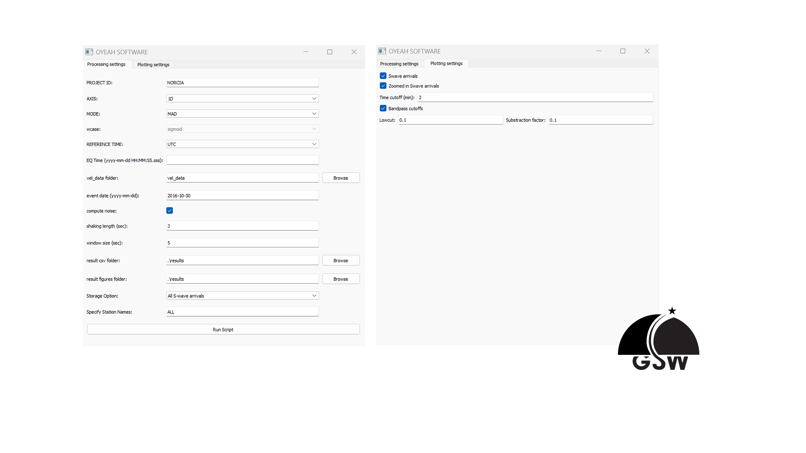

## Version
**Release v1.0.1 – April 13, 2025**

This software was tested and verified on the following system:

- **Operating Systems**: Windows 11 Home, Version 10.0.22631  

---


## Description

**GSW Picker** is an open-source Python-based tool for analyzing high-rate (≥1 Hz) GNSS velocity data to extract S-wave arrival times and ground shaking parameters (amplitude and duration).  
Designed for large-scale, research-grade seismo-geodetic analysis, it uses asynchronous parallel processing (`concurrent.futures`) for fast and scalable performance.


### Key Features

- **Input format support**:
  - **VarioPy** (`.varout`) – Position difference time series
  - **PRIDE-PPP** (`kin_*`) – PPP position time series
  - **Custom `.oy` format** – For user-defined position difference series

- **Pre-analysis tools**:
  - Noise analysis (Power Spectral Density and autocorrelation)
  - Time/frequency domain inspection (spectrograms)

- **Output formats**:
  - **Numerical**: `.csv` files
  - **Visual**: Plots of station noise and S-wave arrivals

GSW Picker offers a user-friendly GUI and is ideal for handling large GNSS datasets, enabling efficient and scalable seismic analysis.

---


## Installation & Running

### Installation

First, clone the repository to your local machine:
```bash
git clone git@github.com:HJpierzchala/GSWPicker.git
```
You can install **GSW Picker** in one of two ways:


1. **Automatic Installation** (Recommended)

    Use the `install.sh` script for a guided setup.
    
    - Detects your operating system (Windows/macOS/Linux)
    - Creates a Conda environment named `gsw_env` with Python 3.11
    - Installs all required dependencies from `requirements.txt`
    
    Run the script from the root directory:
    
    ```bash
    bash install.sh
    ```


2. **Manual Installation**
    Use this option if the automatic method fails.
    
    - Create conda environment
    ```bash
    conda create -n gsw_env python = 3.11
    ```
    - Activate the environment
    ```bash
    conda activate gsw_env
    ```
    - Install pip (if not already installed)
    ```bash
    conda install pip
    ```
    - Install required packages via pyproject.toml:
    ```bash
    pip install .
    ```
  
  !!! warning
      Be sure to use **Python 3.11**, and match the exact package versions specified in `requirements.txt`.
  </div>
    
[More details can be found in the User Manual.](GSWPicker_user_manual.pdf)


### Running the Software

To launch the GUI:

1. Open your terminal (Anaconda PowerShell Prompt on Windows or Terminal on macOS/Linux).
2. Activate the conda environment:
    ```
    conda activate gsw_env
    ```
3. Navigate to the GSW Picker directory:
    ```
    cd ./GSWPicker/
    ```
4. Run the GUI:
    ```
    python GSWPicker_GUI.py
     ```

    
### Verifying Installation
To confirm that the installation was successful:

1. Launch the GUI.
2. Load the test dataset: `./GSWPicker/vel_data/test`
3. Use the configurations from file: `./GSWPicker/results/test/1D/logs/log_test.txt` or manually input the parameters shown in the figure below.
4. Process the data and compare your output file `<PROJECTID>_MAD_1D.csv` with the reference:  
   `./GSWPicker/results/test/1D/reports/TEST_NORCIA_MAD_1D.csv`

If the files match, your installation is successful!




### Important Parameters

When configuring processing settings in the GUI, the following parameters are key:

- **`MODE`** – Method for ground shaking extraction:
- `MAD`, `SLOPE`, or `W-TEST`
- **`Window size (sec)`** – Length of the residual smoother’s sliding window.  
Recommended: **5 seconds** for high-rate (1–20 Hz) GNSS velocity data.
- **`Shaking length (sec)`** – Minimum duration of a shaking event.  
Recommended: **3 seconds** for high-rate (1–20 Hz) GNSS velocity data.

These parameters significantly impact performance and detection sensitivity. For high-rate GNSS velocity datasets, the recommended values (5s window, 3s shaking length) offer a good starting point.

---


### License

Copyright (c) 2023 - 2025, [Your Organization or Name]

Licensed under the [].

---


### References

[1] A.M. Lapadat et al. (2025), *Title of Paper/Article*, to be updated.
